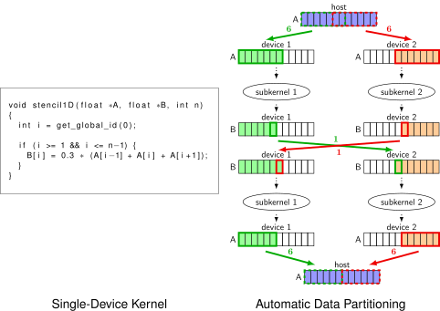
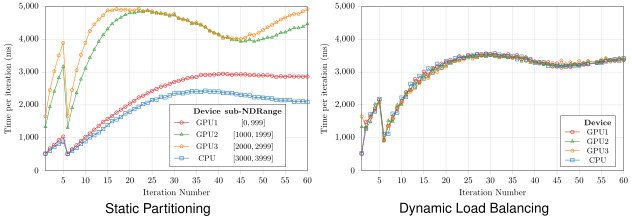

# libsplitCL

**libsplitCL** is a framework to automatically partition a single-device OpenCL application onto multiple heterogeneous devices.

## Features

### Automatic Kernel Splitting

Each kernel is automatically split into sub-kernels (one per device) in order to leverage the computational power of all devices.

 

### Transparent Utilisation

Using **libsplitCL** is completely transparent to the user, it does not require any modification or recompilation its OpenCL application.

### Automatic Data Partitioning

By precisely analyzing the memory region of each buffer accessed by kernels, **libsplitCL** can automatically partition the data onto multiple devices and aims at minimizing the amount of data to transfer between devices.

 

### Dynamic Load Balancing

**libsplitCL** automatically balance the load between devices.
The load balancing method is purely dynamic and does not require offling profiling nor sampling.

 

## Getting Started

These instructions will get you a copy of the project up and running on your local machine.

### Prerequisites

#### CMake `>= 3.1`

CMake can be downloaded from [http://www.cmake.org](http://www.cmake.org).

#### OpenCL
See [https://www.khronos.org/opencl/](https://www.khronos.org/opencl).

#### GLPK - GNU Linear Programming Kit
GLPK can be downloaded from [https://www.gnu.org/software/glpk/#downloading](https://www.gnu.org/software/glpk/#downloading).

#### GSL - Gnu Scientific Library
GSL can be downloaded from [https://www.gnu.org/software/gsl/](https://www.gnu.org/software/gsl/).

#### LLVM `= 3.9.1`

To get LLVM, follow these steps:

```bash
git clone -b release_39 --depth=1 --single-branch https://github.com/llvm-mirror/llvm.git llvm
cd llvm/tools/
git clone -b release_39 --depth=1 --single-branch https://github.com/llvm-mirror/clang.git clang
cd .. && mkdir build && cd build
cmake ..
make -j8
make install 
```

### Installing

First make sure to have installed a C++11 compiler, CMake and Git. Then install PARCOACH by running:

```bash
git clone https://github.com/libsplitcl/libsplitcl.git
mkdir libsplitcl/build
cd libsplitcl/build
cmake ..
make -j4
```

If CMake does not find LLVM, you can supply the path to your LLVM installation as follows  :
```bash
cmake .. -DCMAKE_PREFIX_PATH=/path/to/llvm-3.9.1/
```

## Usage
Edit the file bin/lisplit, then add bin/ to your PATH.

To display all available options :

```
HELP=1 libsplit ./my-opencl-app
```

To split the kernels onto 2 devices

```
DEVICES="<platform0> <device0> <platform1> <device1> ./my-opencl-app
```


## Publications

Pierre Huchant,	Marie-Christine Counilh, and Denis Bartou  
**[Adaptive Partitioning for Iterated Sequences of Irregular OpenCL Kernels](https://doi.org/10.1109/CAHPC.2018.8645867)**,  
*30th International Symposium on Computer Architecture and High Performance Computing (SBAC-PAD), 2018*

Pierre Huchant,	Marie-Christine Counilh, and Denis Bartou  
**[Automatic OpenCL Task Adaptation for Heterogeneous Architectures](https://doi.org/10.1007/978-3-319-43659-3_50)**,  
*Proceedings of the 22nd International Conference on Euro-Par 2016: Parallel Processing - Volume 9833 Pages 684-696, 2016*

## License
TODO

## Developper Documentation
#### ClInline and ClTransform

Those tools perform source-to-source transformations over OpenCL C codes.
ClInline allows to have to whole kernel into a single LLVM function in
order to avoid an inter-procedural analysis.
ClTransform makes the appropriate transformations so that the kernel can be
executed with a fraction of the NDRange.

#### LibKernelExpr

This library implements data structures needed to store parametric buffer
regions accessed by a kernel depending on the NDRange.

#### AnalysisPass

This LLVM pass analyses OpenCL Kernels in SPIR intermediate representation in
order to compute the parametric buffer regions accessed by a kernel.

#### Libsplit

This library interpose OpenCL API calls in order to automatically split the
kernels in a manner transparent to the user.

At kernel creation, the kernel is analyzed using AnalysisPass and transformed
using ClInline and ClTransform.

At kernel execution, a scheduler determine a partitioning of the kernel among
the devices, then the parametric analysis is instantiated with this partition in
order to determine how to split the data. Finally the data required by each
sub-kernel is sent to the devices and the sub-kernels are executed.

## External links

[libsplitCL benchmarks](https://github.comlibsplitcl/benchmarks)